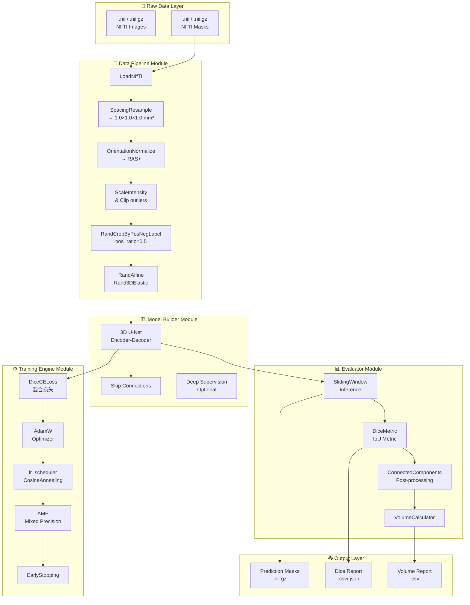
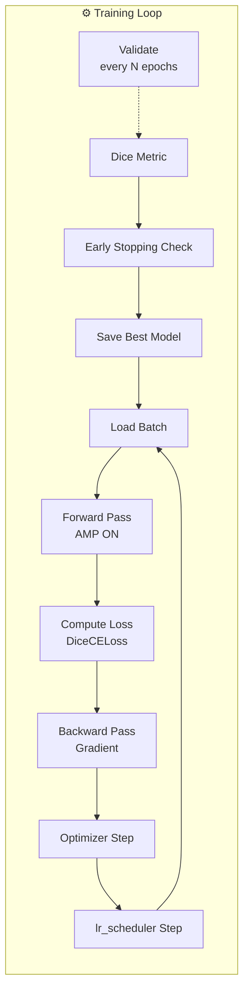

# Design Document

## MONAI 3D 医学影像分割与分析系统

---

## 1. 核心设计目标

本系统旨在构建一个高效、稳健的 3D 医学影像分割与分析 pipeline，重点解决以下技术挑战：

| 挑战 | 设计策略 |
|------|----------|
| **显存限制** | Patch-based 采样 + 批次大小动态控制 |
| **类别不平衡** | 正负样本中心裁剪策略 (1:1 ~ 1:3) |
| **拼接伪影** | 滑窗Overlap融合 + 3D连通域后处理 |
| **推理效率** | Sliding Window Inference + AMP |

---

## 2. 系统架构总览

### 2.1 数据流架构图



### 2.2 3D U-Net 网络架构

```
                    ┌─────────────────────────────────────────────────┐
                    │                 INPUT (C, D, H, W)              │
                    │              e.g., (1, 128, 128, 128)            │
                    └─────────────────────┬───────────────────────────┘
                                          │
                    ┌─────────────────────▼───────────────────────────┐
                    │         ENCODER PATH (Contracting)              │
                    │  ┌─────────────────────────────────────────┐    │
                    │  │ Conv3d → BN → ReLU → Conv3d → BN → ReLU │    │
                    │  └─────────────────────────────────────────┘    │
                    │                      ↓ 2× Downsample            │
                    │  Level 1:  (32, 64, 64, 64)  -  conv1          │
                    │  Level 2:  (64, 32, 32, 32)  -  conv2          │
                    │  Level 3:  (128, 16, 16, 16) -  conv3          │
                    │  Level 4:  (256, 8, 8, 8)    -  conv4          │
                    │                      ↓                          │
                    │  ┌─────────────────────────────────────────┐    │
                    │  │         Bottleneck (512ch)              │    │
                    │  └─────────────────────────────────────────┘    │
                    └─────────────────────┬───────────────────────────┘
                                          │
                    ┌─────────────────────▼───────────────────────────┐
                    │              DECODER PATH (Expanding)            │
                    │  Level 4': (256, 8, 8, 8)    -  upconv4         │
                    │  Level 3': (128, 16, 16, 16) -  upconv3 + skip  │
                    │  Level 2': (64, 32, 32, 32)  -  upconv2 + skip  │
                    │  Level 1': (32, 64, 64, 64)  -  upconv1 + skip  │
                    └─────────────────────┬───────────────────────────┘
                                          │
                    ┌─────────────────────▼───────────────────────────┐
                    │            Final Conv (1×1×1, sigmoid)         │
                    │                 OUTPUT (1, D, H, W)             │
                    └─────────────────────────────────────────────────┘
```

---

## 3. 模块详细设计

### 3.1 `data_pipeline` 模块

**职责**: 负责 NIfTI 读取、体素重采样、归一化及在线 3D 空间增强。

#### 3.1.1 核心组件

| 组件 | 功能 | 关键参数 |
|------|------|----------|
| `LoadNIfTI` | 加载图像与标签 | `image_only=False` |
| `SpacingResample` | 物理空间重采样 | `pixdim=(1.0, 1.0, 1.0)`, `mode=("bilinear", "nearest")` |
| `OrientationTransform` | 方向归一化 | `axcodes="RAS"` |
| `ScaleIntensity` | 强度缩放裁剪 | `minv=0.0, maxv=1.0` 或 `a_min=-175, a_max=250` (CT) |
| `RandCropByPosNegLabel` | **正负样本Patch裁剪** | `spatial_size=(128,128,128)`, `pos_ratio=0.5`, `num_samples=1` |
| `RandAffine` | 随机仿射变换 | `rotate=(-15°, 15°)`, `scale=(0.9, 1.1)`, `translate=(−5mm, 5mm)` |
| `Rand3DElastic` | 随机弹性形变 | `sigma=(5, 10)`, `magnitude=(0, 50)` |
| `ToTensor` | 转换为 PyTorch Tensor | - |

#### 3.1.2 显存与算力优化策略

**Patch-based 采样 (Patch Sampling)**

```
┌─────────────────────────────────────────────────────────────┐
│                    FULL 3D IMAGE                             │
│  Shape: e.g., (512, 512, ~200) for typical CT              │
│  Memory: ~200 MB (float32)                                 │
│                                                             │
│  ┌──────────────────┐  ┌──────────────────┐               │
│  │   PATCH 1        │  │   PATCH 2        │  ...          │
│  │ (128,128,128)    │  │ (128,128,128)    │               │
│  │ Memory: ~8.4 MB  │  │ Memory: ~8.4 MB  │               │
│  └──────────────────┘  └──────────────────┘               │
└─────────────────────────────────────────────────────────────┘
```

**批次大小控制 (Batch Size Control)**

| GPU 显存 | 推荐 Patch Size | 最大 Batch Size | 训练策略 |
|----------|-----------------|------------------|----------|
| 6 GB | 96×96×96 | 1 | 梯度累积 (accumulation_steps=4) |
| 8 GB | 128×128×128 | 1-2 | 混合精度 (AMP) |
| 12 GB | 128×128×128 | 2-4 | 混合精度 (AMP) |
| 24 GB | 192×192×192 | 4-8 | 全精度 / AMP |

**梯度累积 (Gradient Accumulation)**
```python
# 逻辑批次大小 = micro_batch_size × accumulation_steps
effective_batch_size = 2  # micro=1, accumulation=2
```

#### 3.1.3 前景/背景类别不平衡处理

**问题背景**:
- 脾脏等器官在 CT 体积中占比仅 ~0.1-0.5%
- 直接随机裁剪会导致模型主要学习背景特征

**解决方案: `RandCropByPosNegLabel`**

```
Positive Center:  落在前景区域内的随机像素位置
Negative Center:  落在背景区域内的随机像素位置

pos_ratio = 0.5  →  50% 裁剪以前景为中心
                  →  50% 裁剪以背景为中心

裁剪结果示例 (128³):
┌────────────────────────────────┐
│     ┌───────┐                  │
│     │ Spleen│  ← 前景为中心     │
│     └───────┘                  │
│                                │
│         ┌───────┐              │
│         │       │  ← 背景为中心 │
│         └───────┘              │
└────────────────────────────────┘
```

**配置参数**:
```python
RandCropByPosNegLabel(
    spatial_size=(128, 128, 128),   # Patch 尺寸
    pos_ratio=0.5,                   # 正负样本 1:1 比例
    margin=16,                       # 前景中心周围的最小边距
    num_classes=1,                   # 二分类（前景/背景）
    num_samples=1,                   # 每次采样 1 个 Patch
    image_key="image",
    label_key="label"
)
```

#### 3.1.4 数据 Pipeline 配置示例

```python
train_transforms = Compose([
    LoadNIfTI(keys=["image", "label"]),
    SpacingResample(
        keys=["image", "label"],
        pixdim=(1.0, 1.0, 1.0),
        mode=["bilinear", "nearest"]
    ),
    OrientationTransform(keys=["image", "label"], axcodes="RAS"),
    ScaleIntensityRanged(
        keys=["image"],
        a_min=-175, a_max=250,       # CT 脏器窗宽窗位
        b_min=0.0, b_max=1.0,
        clip=True
    ),
    RandCropByPosNegLabel(
        keys=["image", "label"],
        spatial_size=(128, 128, 128),
        pos_ratio=0.5,
        num_classes=1
    ),
    RandAffined(
        keys=["image", "label"],
        mode=["bilinear", "nearest"],
        rotate_range=(15, 15, 15),
        scale_range=(0.1, 0.1, 0.1),
        translate_range=(5, 5, 5)
    ),
    ToTensord(keys=["image", "label"])
])
```

---

### 3.2 `model_builder` 模块

**职责**: 定义 3D U-Net 网络架构，支持灵活配置网络深度与通道数。

#### 3.2.1 网络结构配置

```python
# 3D U-Net 架构参数
network_config = {
    "spatial_dims": 3,
    "in_channels": 1,                    # 单模态输入 (CT/MRI)
    "out_channels": 1,                   # 二分类输出 ( sigmoid )
    "channels": (32, 64, 128, 256),      # 编码器各层通道数
    "strides": (2, 2, 2),                # 下采样步长
    "num_res_units": 2,                  # 每个 Block 的残差单元数
    "norm": "batch",                    # 归一化方式: batch / instance
    "act": "relu",                       # 激活函数: relu / prelu / leaky_relu
    "dropout": 0.1,                      # Dropout 比率
}
```

#### 3.2.2 编码器-解码器详细设计

```
ENCODER ( Contracting Path ):
┌──────────────────────────────────────────────────────────┐
│  Input (1, 128, 128, 128)                                │
│      │                                                   │
│      ▼ ConvBlock 1                                       │
│  (32, 128, 128, 128)  ──────────────────────────────┐   │
│      │                                          Skip 1 │
│      ▼ Down                                      ───────┘
│  (64, 64, 64, 64)                                      │
│      │                                                   │
│      ▼ ConvBlock 2                                       │
│  (128, 64, 64, 64)  ───────────────────────────────┐   │
│      │                                          Skip 2 │
│      ▼ Down                                      ───────┘
│  (256, 32, 32, 32)                                      │
│      │                                                   │
│      ▼ ConvBlock 3                                       │
│  (512, 32, 32, 32)  ───────────────────────────────┐   │
│      │                                          Skip 3 │
│      ▼ Down                                      ───────┘
│  (1024, 16, 16, 16)                                     │
└──────────────────────────────────────────────────────────┘
                           │
                           ▼ Bottleneck
┌──────────────────────────────────────────────────────────┐
│  (1024, 16, 16, 16)                                      │
└──────────────────────────────────────────────────────────┘
                           │
DECODER ( Expanding Path ):                                │
┌──────────────────────────────────────────────────────────┐
│                           │                              │
│      ┌────────────────────┘                              │
│      ▼ Up                                              │
│  (512, 32, 32, 32)  ◄────── Concatenate Skip 3          │
│      │                                                   │
│      ▼ ConvBlock                                         │
│  (256, 32, 32, 32)                                       │
│      │                                                   │
│      ┌────────────────────┘                              │
│      ▼ Up                                              │
│  (256, 64, 64, 64)  ◄────── Concatenate Skip 2          │
│      │                                                   │
│      ▼ ConvBlock                                         │
│  (128, 64, 64, 64)                                       │
│      │                                                   │
│      ┌────────────────────┘                              │
│      ▼ Up                                              │
│  (64, 128, 128, 128) ◄────── Concatenate Skip 1         │
│      │                                                   │
│      ▼ ConvBlock                                         │
│  (32, 128, 128, 128)                                     │
│      │                                                   │
│      ▼ Final Conv 1×1×1 + Sigmoid                       │
│  (1, 128, 128, 128)                                      │
│      │                                                   │
│      ▼ OUTPUT: Prediction Mask                          │
└──────────────────────────────────────────────────────────┘
```

#### 3.2.3 跳跃连接的作用

| 层级 | 编码器特征 | 解码器特征 | 融合方式 |
|------|------------|------------|----------|
| Level 1 | 32ch, 128³ | 32ch, 128³ | Concat → 64ch |
| Level 2 | 64ch, 64³ | 64ch, 64³ | Concat → 128ch |
| Level 3 | 128ch, 32³ | 128ch, 32³ | Concat → 256ch |
| Level 4 | 256ch, 16³ | 256ch, 16³ | Concat → 512ch |

---

### 3.3 `training_engine` 模块

**职责**: 训练与验证循环，包含 DiceCELoss 和学习率调度。

#### 3.3.1 损失函数设计

**DiceCELoss = Dice Loss + Cross Entropy Loss**

```
Total_Loss = λ_dice × Dice_Loss + λ_ce × CrossEntropy_Loss

推荐权重: λ_dice = 1.0, λ_ce = 1.0
```

**Dice Loss 定义**:
```
Dice = (2 × |A ∩ B|) / (|A| + |B|)
Dice_Loss = 1 - Dice

其中:
- A = 预测概率 (0~1)
- B = Ground Truth (0 或 1)
```

**为什么使用混合损失**:
- **Dice Loss**: 对类别不平衡鲁棒，优化重叠率
- **CE Loss**: 提供逐像素的梯度信号，稳定训练

#### 3.3.2 训练循环设计



#### 3.3.3 训练配置参数

```python
training_config = {
    # 优化器
    "optimizer": {
        "type": "AdamW",
        "lr": 1e-4,
        "weight_decay": 1e-5,
        "betas": (0.9, 0.999)
    },

    # 学习率调度
    "lr_scheduler": {
        "type": "CosineAnnealingLR",
        "T_max": 100,               # 周期数
        "eta_min": 1e-6            # 最低学习率
    },

    # 损失函数
    "loss": {
        "type": "DiceCELoss",
        "lambda_dice": 1.0,
        "lambda_ce": 1.0,
        "sigmoid": True
    },

    # 训练策略
    "training": {
        "max_epochs": 200,
        "early_stopping": {
            "patience": 20,         # 连续 20 个 epoch 无改善则停止
            "min_delta": 0.001,     # 改善阈值
            "monitor": "val_mean_dice"
        },
        "amp": True,               # 混合精度训练
        "gradient_clip": 1.0,     # 梯度裁剪
        "gradient_accumulation": 2 # 梯度累积步数
    },

    # 验证
    "validation": {
        "metric": "dice",
        "interval": 5             # 每 5 epoch 验证一次
    }
}
```

#### 3.3.4 AMP (混合精度训练) 策略

```python
# 启用 AMP 后的内存节省效果
| 精度    | 显存占用 | 训练速度 | 模型精度 |
|---------|----------|---------|----------|
| FP32    | 100%     | 1.0×    | 基准     |
| AMP     | ~60%     | ~1.5×   | 基本不变  |
| FP16    | ~50%     | ~1.8×   | 可能下降  |
```

---

### 3.4 `evaluator` 模块

**职责**: 滑窗推理、Dice 计算、3D 连通域后处理。

#### 3.4.1 滑窗推理 (Sliding Window Inference)

**核心问题**: 3D 图像太大，无法一次性加载到 GPU 显存。

**解决方案**: 使用滑窗逐块推理，结果通过Overlap融合。

```
┌──────────────────────────────────────────────────────────┐
│                                                          │
│    ┌────────┐                                           │
│    │ swin_1 │                    滑动方向 ──────────────►
│    └────────┘                                           │
│         │                                               │
│         ▼                                               │
│    ┌────────┐                                           │
│    │ swin_2 │                                           │
│    └────────┘                                           │
│         │                                               │
│         ▼                                               │
│    ┌────────┐                                           │
│    │ swin_n │                                           │
│    └────────┘                                           │
│                                                          │
└──────────────────────────────────────────────────────────┘

Patch Size:     128×128×128
Stride:          64×64×64   (50% overlap)
Overlap Ratio:   50%
Blend Mode:      Gaussian  (减少边缘伪影)
```

#### 3.4.2 Overlap 融合策略

```mermaid
flowchart LR
    subgraph WindowOverlap["滑窗重叠处理"]
        A[Window 1<br/>128³] --> B[权重图 W1<br/>边缘低/中心高]
        C[Window 2<br/>128³] --> D[权重图 W2<br/>边缘低/中心高]
        B --> E[像素级融合<br/>P = Σ(Wi×Pi) / ΣWi]
        D --> E
    end
```

**Gaussian 权重图示例**:
```
一维示意图 (stride=64, size=128):

位置:    0        64       128      192      256
         ├────────┼────────┼────────┼────────┤
权重:    0.0     0.5      1.0      0.5      0.0

         ████
       ████████
     ████████████
   ████████████████
████████████████████
   ████████████████
     ████████████
       ████████
         ████
```

#### 3.4.3 滑窗推理配置参数

```python
sliding_window_config = {
    "roi_size": (128, 128, 128),       # 滑窗尺寸
    "sw_batch_size": 4,                 # 每次推理的窗口数
    "stride": (64, 64, 64),            # 步长 (50% overlap)
    "overlap": 0.5,                    # 重叠率
    "blend_mode": "gaussian",          # 融合模式: gaussian / constant
    "padding_mode": "constant",        # 边缘填充: constant / reflection
    "cval": 0,                         # 填充值
    "sw_device": "cuda",              # 滑窗推理设备
    "device": "cuda"                   # 结果汇总设备
}
```

#### 3.4.4 推理流程


#### 3.4.5 后处理: 3D 连通域分析

```python
post_transforms = Compose([
    Activationsd(keys="pred", sigmoid=True),
    AsDiscreted(keys="pred", threshold=0.5),
    KeepLargestConnectedComponentd(keys="pred", applied_over_labels=[1]),
    # 可选: 移除过小或过大的分割区域
    # RemoveSmallObjectsd(keys="pred", min_size=500),  # 单位: 体素个数
])
```

**连通域后处理规则**:
| 步骤 | 操作 | 目的 |
|------|------|------|
| 1 | 阈值化 (threshold=0.5) | 二值化分割结果 |
| 2 | 保留最大连通域 | 去除孤立噪声点 |
| 3 | 形态学开/闭运算 | 填充小孔洞、平滑边界 |
| 4 | 体积过滤 | 剔除异常小的脏器 |

#### 3.4.6 评估指标计算

| 指标 | 公式 | 用途 |
|------|------|------|
| **Dice Similarity Coefficient** | `DSC = 2|A∩B|/(|A|+|B|)` | 主要评估指标 |
| IoU / Jaccard | `IoU = \|A∩B\|/\|A∪B\|` | 与 Dice 配套使用 |
| Precision | `TP/(TP+FP)` | 衡量假阳性 |
| Recall | `TP/(TP+FN)` | 衡量假阴性 |
| HD95 | 95th percentile Hausdorff Distance | 边界质量评估 |

---

## 4. 显存与算力优化总结

### 4.1 OOM 防护策略优先级

| 优先级 | 策略 | 显存节省 | 速度影响 |
|--------|------|---------|----------|
| 1 | Patch-based Sampling (128³) | ~80% | 轻微下降 |
| 2 | 梯度累积 (accumulation=2) | ~50% | 轻微下降 |
| 3 | AMP (混合精度) | ~40% | 提升 1.5× |
| 4 | 验证时 Drop BN | ~10% | 无 |
| 5 | 梯度裁剪 | 防止溢出 | 无 |

### 4.2 推荐配置对照表

| GPU 显存 | Patch Size | Batch Size | AMP | 梯度累积 |
|----------|------------|------------|-----|----------|
| 6 GB | 96³ | 1 | ON | 4 |
| 8 GB | 128³ | 1 | ON | 2 |
| 12 GB | 128³ | 2 | ON | 1 |
| 24 GB | 192³ | 4 | ON | 1 |

---

## 5. 依赖管理

### 5.1 核心依赖

```txt
# requirements.txt
monai>=1.2.0              # 核心框架
torch>=2.0.0              # 深度学习后端
nibabel>=5.0.0            # NIfTI 格式读写
SimpleITK>=2.2.0          # 医学影像处理
pytorch-ignite>=0.4.0     # 训练循环辅助
```

### 5.2 可视化依赖

```txt
matplotlib>=3.7.0         # 2D 切片可视化
plotly>=5.15.0            # 交互式可视化
itk>=5.3.0                # 3D 体渲染
```

### 5.3 工具依赖

```txt
numpy>=1.24.0             # 数值计算
pandas>=2.0.0              # 数据分析
scipy>=1.10.0             # 科学计算
scikit-learn>=1.3.0       # 后处理
tqdm>=4.65.0              # 进度条
pyyaml>=6.0               # 配置文件
```

### 5.4 环境安装命令

```bash
# 使用 pip 安装
pip install monai nibabel SimpleITK torch torchvision
pip install matplotlib plotly itk pandas scikit-learn

# 或使用 conda (推荐)
conda create -n monai python=3.10
conda activate monai
pip install monai nibabel SimpleITK
```

---

## 6. 项目目录结构

```
MONAI/
├── rawdata/                           # 原始数据集 (下载存放)
│   ├── MSD_Spleen/                    # MSD 脾脏数据集
│   └── MSD_BrainTumor/                # MSD 脑肿瘤数据集
├── data/                              # 处理后的数据
│   ├── processed/                     # 标准化后的图像
│   └── cache/                         # 预处理缓存
├── models/                            # 模型相关
│   ├── checkpoints/                  # 训练检查点
│   └── configs/                       # 模型配置文件
├── results/                           # 输出结果
│   ├── predictions/                   # 预测的 Mask
│   ├── reports/                       # Dice 评估报告
│   └── volumes/                       # 体积计算报告
├── src/                               # 源代码
│   ├── data_pipeline/                 # 数据处理模块
│   │   ├── __init__.py
│   │   ├── transforms.py              # MONAI Transforms 定义
│   │   ├── datasets.py               # 数据集类定义
│   │   └── utils.py                  # 数据工具函数
│   ├── model_builder/                 # 模型构建模块
│   │   ├── __init__.py
│   │   ├── unet.py                    # 3D U-Net 定义
│   │   └── config.py                 # 网络配置
│   ├── training_engine/               # 训练引擎模块
│   │   ├── __init__.py
│   │   ├── trainer.py                 # 训练循环
│   │   ├── loss.py                   # 损失函数
│   │   └── utils.py                  # 训练工具
│   └── evaluator/                    # 评估模块
│       ├── __init__.py
│       ├── inference.py               # 滑窗推理
│       ├── metrics.py                # 评估指标
│       └── postprocess.py            # 后处理
├── scripts/                           # 脚本
│   ├── download_data.py              # 数据集下载脚本
│   ├── train.py                      # 训练入口
│   ├── evaluate.py                   # 评估入口
│   └── predict.py                    # 推理入口
├── configs/                          # 配置文件
│   ├── train_config.yaml             # 训练配置
│   └── inference_config.yaml         # 推理配置
├── notebooks/                        # Jupyter notebooks
│   ├── data_exploration.ipynb        # 数据探索
│   └── visualization.ipynb           # 结果可视化
├── tests/                            # 单元测试
│   ├── test_data_pipeline.py
│   ├── test_model.py
│   └── test_evaluator.py
├── requirements.txt
├── requirements-dev.txt
├── setup.py
├── design.md
├── requirements.md
└── README.md
```

---

## 7. 模块接口约定

### 7.1 `data_pipeline` 接口

```python
class DataPipeline:
    def __init__(self, config: dict):
        """初始化 Pipeline"""

    def get_train_transforms(self) -> Compose:
        """返回训练数据增强 Pipeline"""

    def get_val_transforms(self) -> Compose:
        """返回验证 Pipeline (无增强)"""

    def get_inference_transforms(self) -> Compose:
        """返回推理 Pipeline"""

    def create_dataloader(
        self,
        data_dir: str,
        mode: str = "train",
        batch_size: int = 1,
        num_workers: int = 4
    ) -> DataLoader:
        """创建数据加载器"""
```

### 7.2 `model_builder` 接口

```python
class ModelBuilder:
    def __init__(self, config: dict):
        """初始化模型构建器"""

    def build_model(self) -> nn.Module:
        """返回 3D U-Net 模型"""

    def load_pretrained(self, checkpoint_path: str) -> nn.Module:
        """加载预训练权重"""

    def save_checkpoint(self, path: str):
        """保存模型检查点"""
```

### 7.3 `training_engine` 接口

```python
class TrainingEngine:
    def __init__(
        self,
        model: nn.Module,
        optimizer,
        loss_fn,
        device: str = "cuda"
    ):
        """初始化训练引擎"""

    def train(
        self,
        train_loader: DataLoader,
        val_loader: DataLoader,
        max_epochs: int = 100
    ) -> dict:
        """执行训练循环，返回训练历史"""

    def validate(self, val_loader: DataLoader) -> dict:
        """执行验证，返回指标字典"""
```

### 7.4 `evaluator` 接口

```python
class Evaluator:
    def __init__(
        self,
        model: nn.Module,
        config: dict,
        device: str = "cuda"
    ):
        """初始化评估器"""

    def sliding_window_inference(
        self,
        image: torch.Tensor
    ) -> torch.Tensor:
        """滑窗推理，返回预测概率"""

    def compute_metrics(
        self,
        prediction: torch.Tensor,
        ground_truth: torch.Tensor
    ) -> dict:
        """计算 Dice、IoU 等指标"""

    def postprocess(self, prediction: torch.Tensor) -> torch.Tensor:
        """后处理：连通域分析"""

    def compute_volume(
        self,
        mask: np.ndarray,
        spacing: tuple
    ) -> float:
        """计算脏器体积 (mm³ / cm³)"""

    def generate_report(
        self,
        results: list,
        output_path: str,
        format: str = "csv"
    ):
        """生成评估报告"""
```

---

## 8. 数据兼容性矩阵

| 数据格式 | 读取支持 | 写入支持 | 备注 |
|----------|---------|---------|------|
| NIfTI (.nii, .nii.gz) | ✅ NiBabel | ✅ NiBabel | 主要格式 |
| DICOM (.dcm) | ✅ SimpleITK | ❌ | 需额外处理 |
| MHD (.mhd + .raw) | ✅ SimpleITK | ✅ SimpleITK | ITK 格式 |
| NRRD (.nrrd) | ✅ SimpleITK | ✅ SimpleITK | ITK 格式 |
| PNG/JPEG (2D) | ✅ PIL/numpy | ✅ PIL | 仅 2D 切片 |

---

## 9. 设计决策记录

| 决策项 | 选择 | 替代方案 | 原因 |
|--------|------|---------|------|
| Patch Size | 128³ | 96³ / 192³ | 平衡显存占用与上下文信息 |
| 重叠率 | 50% | 25% / 75% | 足够消除伪影且不过度增加计算 |
| 损失函数 | DiceCELoss | FocalLoss | Dice 处理类别不平衡 + CE 稳定训练 |
| 优化器 | AdamW | SGD + Momentum | AdamW 收敛更快，泛化更好 |
| 学习率调度 | CosineAnnealing | StepLR | 平滑衰减，避免学习率骤降 |
| AMP | ON | OFF | 显著减少显存，支持更大 Batch |
| 后处理 | 连通域保留最大 | 无后处理 | 去除孤立噪声点 |

---

*Design Document Version: 1.0*
*Created: 2026-03-23*
