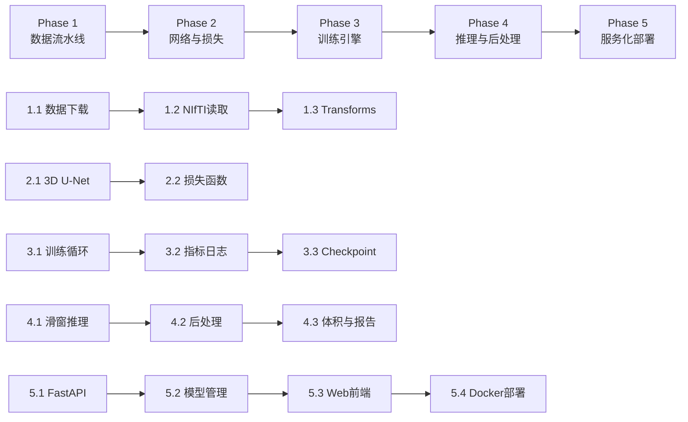

# Task Document

## MONAI 3D 医学影像分割与分析系统 — 开发任务清单

本文档将项目开发划分为 **5 个阶段（Phase）**，每个阶段包含 **2~4 个可执行子任务**，每个任务明确标注预期输出文件。

---

## Phase 1: 3D 数据流水线搭建

### 任务 1.1: 数据集下载与目录管理

**目标**: 实现自动下载公开医学影像数据集（MSD Spleen），并按标准目录结构组织。

**执行内容**:
- 创建 `scripts/download_data.py` 下载脚本
- 创建 `rawdata/` 目录结构
- 支持 MSD Spleen 数据集的下载与解压
- 生成数据集元信息（文件列表、spacing、shape 统计）

**预期输出文件**:
| 文件路径 | 说明 |
|----------|------|
| `scripts/download_data.py` | 数据集下载脚本 |
| `scripts/verify_data.py` | 数据完整性校验脚本 |
| `rawdata/MSD_Spleen/images/` | 原始 CT 图像 (.nii.gz) |
| `rawdata/MSD_Spleen/labels/` | 标注 Mask (.nii.gz) |
| `rawdata/dataset_info.json` | 数据集元信息（文件列表、统计） |

---

### 任务 1.2: NIfTI 读取与物理空间标准化

**目标**: 实现 3D 图像的加载、Spacing 重采样、Orientation 归一化。

**执行内容**:
- 实现 NIfTI 文件读取（NiBabel）
- 实现 Spacing 重采样至 1.0×1.0×1.0 mm³（SimpleITK）
- 实现 Orientation 归一化为 RAS+ 标准
- 实现强度裁剪与归一化（CT 窗宽窗位处理）
- 封装为可复用工具函数

**预期输出文件**:
| 文件路径 | 说明 |
|----------|------|
| `src/data_pipeline/loaders.py` | NIfTI 读取与格式转换 |
| `src/data_pipeline/resample.py` | Spacing/Orientation 标准化 |
| `src/data_pipeline/normalizer.py` | 强度归一化（ScaleIntensity） |
| `tests/test_loaders.py` | 读取模块单元测试 |
| `tests/test_resample.py` | 重采样模块单元测试 |

---

### 任务 1.3: MONAI Transforms 流水线与数据加载器

**目标**: 基于 MONAI 构建完整的训练/验证/推理 Transform 流水线，实现 Patch-based 采样与 3D 数据增强。

**执行内容**:
- 实现训练 Transform 流水线（含数据增强）
  - `LoadNIfTI` → `SpacingResample` → `OrientationTransform` → `ScaleIntensityRanged`
  - `RandCropByPosNegLabel`（正负样本 1:1 裁剪）
  - `RandAffine`（随机仿射变换）
  - `Rand3DElastic`（随机弹性形变）
- 实现验证/推理 Transform 流水线（无增强）
- 实现 `CacheDataset` 与 `DataLoader` 配置
- 配置 GPU 显存友好的批次大小与 num_workers

**预期输出文件**:
| 文件路径 | 说明 |
|----------|------|
| `src/data_pipeline/transforms.py` | MONAI Transforms 定义 |
| `src/data_pipeline/datasets.py` | Dataset 与 DataLoader 封装 |
| `src/data_pipeline/__init__.py` | 模块导出 |
| `configs/data_config.yaml` | 数据流水线配置参数 |
| `tests/test_transforms.py` | Transform 流水线单元测试 |

---

## Phase 2: 网络构建与损失定义

### 任务 2.1: 3D U-Net 网络架构实现

**目标**: 基于 MONAI 实现可配置的 3D U-Net 分割网络。

**执行内容**:
- 使用 MONAI `UNet` 构建 3D 分割网络
- 配置网络深度、通道数、跳跃连接
- 支持残差单元（ResNet Block）
- 支持 Dropout 正则化
- 实现网络权重初始化

**预期输出文件**:
| 文件路径 | 说明 |
|----------|------|
| `src/model_builder/unet.py` | 3D U-Net 模型定义 |
| `src/model_builder/config.py` | 网络配置参数 |
| `src/model_builder/__init__.py` | 模块导出 |
| `configs/model_config.yaml` | 网络架构配置文件 |
| `tests/test_unet.py` | 模型单元测试（参数验证、输出 shape） |

---

### 任务 2.2: 损失函数定义

**目标**: 实现 DiceCELoss 混合损失函数，并封装为可配置组件。

**执行内容**:
- 实现 Dice Loss（处理类别不平衡）
- 实现 Cross Entropy Loss
- 实现 DiceCELoss 混合损失
- 支持可配置的损失权重
- 集成到 MONAI `BasicTrainer` 框架

**预期输出文件**:
| 文件路径 | 说明 |
|----------|------|
| `src/training_engine/loss.py` | DiceCELoss 损失函数定义 |
| `tests/test_loss.py` | 损失函数单元测试 |

---

## Phase 3: 训练引擎与验证逻辑

### 任务 3.1: 训练循环与验证引擎

**目标**: 实现完整的训练循环，支持 AMP 混合精度、早停、学习率调度。

**执行内容**:
- 配置 AdamW 优化器
- 配置 CosineAnnealing 学习率调度器
- 实现 AMP 混合精度训练（`GradScaler`）
- 实现 Early Stopping 早停机制
- 实现验证循环（每 N epoch 执行一次）
- 实现最佳模型保存（基于验证 Dice）

**预期输出文件**:
| 文件路径 | 说明 |
|----------|------|
| `src/training_engine/trainer.py` | 训练循环主逻辑 |
| `src/training_engine/validator.py` | 验证循环逻辑 |
| `src/training_engine/scheduler.py` | 学习率调度器封装 |
| `src/training_engine/__init__.py` | 模块导出 |
| `scripts/train.py` | 训练入口脚本 |
| `configs/train_config.yaml` | 训练超参数配置 |

---

### 任务 3.2: Dice 评估指标与训练日志

**目标**: 实现 Dice Metric 计算、训练历史记录、TensorBoard 日志。

**执行内容**:
- 实现 Dice Metric 计算（MONAI `DiceMetric`）
- 实现 IoU Metric（可选）
- 实现训练历史记录（epoch、loss、metric）
- 集成 TensorBoard 日志记录
- 生成训练曲线图（loss、dice vs epoch）

**预期输出文件**:
| 文件路径 | 说明 |
|----------|------|
| `src/training_engine/metrics.py` | 评估指标定义（Dice、IoU） |
| `src/training_engine/logger.py` | 训练日志记录器 |
| `scripts/visualize_training.py` | 训练曲线可视化脚本 |
| `results/logs/train_history.csv` | 训练历史记录 |
| `results/logs/events.*` | TensorBoard 日志文件 |

---

### 任务 3.3: Checkpoint 管理与恢复

**目标**: 实现模型检查点保存与恢复功能。

**执行内容**:
- 实现检查点保存（模型权重、优化器状态、lr_scheduler、epoch）
- 实现断点恢复（从最新检查点继续训练）
- 支持预训练权重加载
- 自动保存最佳模型

**预期输出文件**:
| 文件路径 | 说明 |
|----------|------|
| `src/training_engine/checkpoint.py` | 检查点管理工具 |
| `models/checkpoints/` | 检查点存储目录 |
| `models/best_model.pt` | 最佳模型权重 |

---

## Phase 4: 滑窗推理与后处理分析

### 任务 4.1: 滑窗推理引擎

**目标**: 实现 Sliding Window Inference 机制，解决大体积 3D 图像的显存问题。

**执行内容**:
- 实现滑窗遍历逻辑（可配置 ROI Size 与 Stride）
- 实现 Gaussian 加权融合（消除拼接伪影）
- 实现 MONAI `SlidingWindowInference` 封装
- 支持多 GPU 批量滑窗推理

**预期输出文件**:
| 文件路径 | 说明 |
|----------|------|
| `src/evaluator/inference.py` | 滑窗推理器封装 |
| `src/evaluator/__init__.py` | 模块导出 |
| `tests/test_inference.py` | 推理模块单元测试 |

---

### 任务 4.2: 3D 连通域后处理

**目标**: 实现预测结果的后处理（阈值化、连通域分析、形态学操作）。

**执行内容**:
- 实现概率阈值化（threshold=0.5）
- 实现 3D 连通域分析（保留最大连通域）
- 实现形态学后处理（填充孔洞，平滑边界）
- 实现过小/过大区域过滤
- 封装为 MONAI Post-processing Transform

**预期输出文件**:
| 文件路径 | 说明 |
|----------|------|
| `src/evaluator/postprocess.py` | 后处理逻辑 |
| `src/evaluator/__init__.py` | 模块导出 |
| `tests/test_postprocess.py` | 后处理单元测试 |

---

### 任务 4.3: 脏器体积计算与评估报告生成

**目标**: 实现基于预测 Mask 的脏器体积计算，生成结构化评估报告。

**执行内容**:
- 实现体积计算（基于体素个数 × spacing）
- 实现逐病例 Dice Score 计算
- 实现评估报告生成（CSV、JSON 格式）
- 支持批量推理与批量报告生成
- 生成 2D 切片对比可视化

**预期输出文件**:
| 文件路径 | 说明 |
|----------|------|
| `src/evaluator/volume.py` | 体积计算模块 |
| `src/evaluator/reporter.py` | 报告生成模块 |
| `scripts/evaluate.py` | 评估入口脚本 |
| `scripts/predict.py` | 推理入口脚本 |
| `results/predictions/` | 预测 Mask 输出目录 (.nii.gz) |
| `results/reports/dice_scores.csv` | Dice 评估报告 |
| `results/reports/volumes.csv` | 脏器体积报告 |
| `results/visualizations/` | 2D 切片对比图 |

---

## Phase 5: 服务化部署与前端交互

### 任务 5.1: FastAPI 推理服务

**目标**: 将训练好的模型封装为 RESTful API 服务，支持图像上传、推理、结果返回。

**执行内容**:
- 使用 FastAPI 构建推理服务
- 实现图像上传接口（支持 NIfTI 和 DICOM）
- 实现异步推理接口
- 实现批量推理接口
- 实现健康检查接口
- 添加请求参数验证
- 添加 CORS 跨域支持

**预期输出文件**:
| 文件路径 | 说明 |
|----------|------|
| `api/main.py` | FastAPI 主应用 |
| `api/inference.py` | 推理端点实现 |
| `api/models.py` | Pydantic 数据模型 |
| `api/config.py` | 服务配置 |
| `requirements-api.txt` | API 依赖 |

---

### 任务 5.2: 模型加载与缓存管理

**目标**: 实现模型的动态加载、版本管理、内存缓存。

**执行内容**:
- 实现模型热加载/卸载
- 实现模型版本管理
- 实现 GPU 内存管理（多模型共享 GPU）
- 实现推理结果缓存
- 添加模型元信息接口（训练指标、发布时间）

**预期输出文件**:
| 文件路径 | 说明 |
|----------|------|
| `api/model_manager.py` | 模型管理器 |
| `api/cache.py` | 推理缓存 |

---

### 任务 5.3: Web Dashboard 前端

**目标**: 构建可视化 Web 界面，支持图像上传、推理结果显示、结果下载。

**执行内容**:
- 使用 React + TypeScript 构建前端
- 实现图像上传组件（拖拽上传）
- 实现 2D 切片可视化（沿 X/Y/Z 轴滚动）
- 实现推理进度显示
- 实现 Dice/体积结果展示
- 实现结果打包下载（NIfTI + 报告）
- 实现历史记录管理

**预期输出文件**:
| 文件路径 | 说明 |
|----------|------|
| `web/` | Web Dashboard 源代码 |
| `web/package.json` | 前端依赖 |
| `web/src/components/` | React 组件 |
| `web/src/pages/` | 页面组件 |
| `web/src/api/` | API 调用封装 |
| `web/public/` | 静态资源 |

---

### 任务 5.4: Docker 容器化部署

**目标**: 将服务封装为 Docker 镜像，支持一键部署。

**执行内容**:
- 编写 Dockerfile（多阶段构建）
- 编写 docker-compose.yml
- 实现环境变量配置
- 实现健康检查与自动重启
- 优化镜像大小（Python 精简镜像）
- 支持 NVIDIA Docker（GPU 推理）

**预期输出文件**:
| 文件路径 | 说明 |
|----------|------|
| `Dockerfile` | 容器镜像定义 |
| `docker-compose.yml` | 多容器编排 |
| `.dockerignore` | 构建排除文件 |
| `deploy/gpu-compose.yml` | GPU 推理编排 |

---

## Phase 任务依赖关系

---

## 里程碑对照

| Phase | 里程碑 | 核心交付物 |
|-------|--------|-----------|
| Phase 1 | M1 + M2 + M3 | 可运行的 data pipeline，能加载并预处理 NIfTI 数据 |
| Phase 2 | M4 | 3D U-Net 模型，支持 DiceCELoss 训练 |
| Phase 3 | M4 + M5 | 完整训练流程，模型检查点保存与恢复 |
| Phase 4 | M5 + M6 + M7 | 滑窗推理、Mask 输出、评估报告、体积计算 |
| Phase 5 | M8 + M9 | FastAPI 服务、Web Dashboard、Docker 部署 |

---

## 任务优先级排序建议

| 优先级 | 任务 | 原因 |
|--------|------|------|
| P1 | 1.1 数据下载 | 无数据则无法验证后续 pipeline |
| P1 | 1.2 NIfTI 读取 | 后续所有模块依赖图像加载 |
| P1 | 1.3 Transforms | 训练必需的数据增强流水线 |
| P2 | 2.1 3D U-Net | 模型是一切训练的基础 |
| P2 | 2.2 损失函数 | 配合模型进行训练测试 |
| P3 | 3.1 训练循环 | 核心训练流程 |
| P3 | 3.2 指标日志 | 监控训练效果 |
| P3 | 3.3 Checkpoint | 防止训练中断丢失 |
| P4 | 4.1 滑窗推理 | 核心推理逻辑 |
| P4 | 4.2 后处理 | 提升预测质量 |
| P4 | 4.3 体积与报告 | 最终业务输出 |
| P5 | 5.1 FastAPI | 服务化核心接口 |
| P5 | 5.2 模型管理 | 支持多模型切换 |
| P5 | 5.3 Web 前端 | 用户交互界面 |
| P5 | 5.4 Docker 部署 | 一键部署上线 |

---

*Task Document Version: 1.1*
*Created: 2026-03-23*
*Updated: 2026-03-23 - Added Phase 5: 服务化部署与前端交互*
